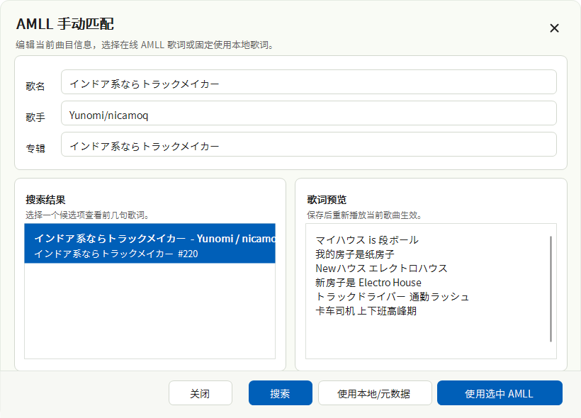

# AMLL TTML Loader for Salt Player

**简体中文** | [English](README.en.md)

这是一个 Salt Player for Windows 插件，用于从 AMLL TTML DB 搜索、加载并转换逐词 TTML 歌词，让 Salt Player 可以显示更接近 AMLL 风格的歌词效果。当在线匹配不可靠或无法获取时，插件会自动回退到本地或默认歌词。

本项目由 Codex 协助完成。

## 功能

- 根据当前歌曲标题、歌手、专辑信息搜索 AMLL TTML DB。
- 将 TTML 逐词歌词转换为 Salt Player 可用的 SPL 样式歌词。
- 支持主歌词、对唱/角色行、翻译、罗马音、背景人声。
- 使用标题优先的自动匹配策略，减少错误匹配。
- 在线搜索等待最多 10 秒，失败或超时则回退到本地/默认歌词。
- 支持同名旁挂 `.ttml`、`.lrc`、`.spl` 歌词文件，以及 FLAC 内嵌歌词元数据中的 TTML 歌词。
- 对被截断的本地内嵌 TTML，会尽量恢复已完整闭合的歌词行。
- 缓存成功匹配，之后同一首歌可快速加载。
- 自动匹配失败记录 7 天，过期后重新尝试。
- 显示紧凑来源行：`来源：AMLL` 或 `来源：本地`。
- 提供手动匹配对话框，支持编辑标题/歌手/专辑、预览搜索结果，并可强制使用本地/默认歌词。
- 提供歌词偏移调整，用于修正歌词与播放进度不同步。
- 自动隐藏 `[ti:xxx]`、`[ar:xxx]` 等歌词内置元数据行。
- 新增运行日志，便于排查插件加载、在线搜索、TTML 转换、缓存读写和手动匹配问题。

## 截图

### 自动加载 AMLL 歌词


### 手动匹配当前歌曲



## 前置要求

普通用户：

- Windows
- Salt Player for Windows
- 能访问 AMLL TTML DB 和 GitHub raw 相关资源

开发者构建：

- JDK 21
- 首次运行 Gradle Wrapper 需要网络，除非本地已有缓存

普通用户安装插件不需要 JDK 21。JDK 21 只在从源码构建时需要。

## 安装方法

1. 从最新 GitHub Release 下载 `AMLL-TTML-Loader-1.0.3.zip`。
2. 将 zip 文件复制到：

   ```text
   %APPDATA%\Salt Player for Windows\workshop\plugins
   ```

3. 重启 Salt Player for Windows。
4. 可选：打开插件设置，使用 `手动匹配当前歌曲` 手动选择 AMLL 结果，或强制当前歌曲使用本地/默认歌词。

## 从源码构建

运行：

```powershell
.\gradlew.bat --no-daemon plugin
```

输出文件：

```text
out\plugin\AMLL-TTML-Loader-1.0.3.zip
```

## 缓存与手动覆盖

插件会将缓存和手动覆盖记录保存到：

```text
%APPDATA%\Salt Player for Windows\workshop\amll-ttml-loader-cache
```

重要文件：

- `raw-lyrics-index.jsonl`：缓存的 AMLL 歌词索引
- `song-cache.tsv`：成功的 AMLL 歌词匹配记录
- `manual-overrides.tsv`：手动选择 AMLL 或本地/默认歌词的记录
- `miss-cache.tsv`：7 天自动匹配失败记录
- `lyric-offset-ms.txt`：全局歌词偏移毫秒数
- `lyrics\*.spl`：转换后的歌词缓存

## 运行日志

运行日志用于排查插件加载、在线搜索、自动匹配、TTML 转换、缓存读写、手动匹配和歌词回退问题。

日志文件保存到：

```text
%APPDATA%\Salt Player for Windows\workshop\amll-ttml-loader-cache\logs
```

日志按日期命名，例如：

```text
amll-ttml-loader-2026-05-15.log
```

日志格式示例：

```text
[2026-05-15 20:30:12] [INFO] [SEARCH] Searching AMLL TTML DB: title="xxx", artist="xxx"
```

日志默认开启。你可以在插件设置中：

- 启用或关闭运行日志
- 切换普通或详细日志
- 设置歌词偏移
- 打开日志目录
- 清理日志

插件会自动清理旧日志，保留最近 7 天或最近 10 个日志文件。日志写入失败不会影响歌词加载。

反馈 bug 时，建议附上相关日志片段；请不要提交包含隐私信息的完整日志。

## 网络与隐私说明

- 插件会根据当前歌曲的标题、歌手、专辑信息请求 AMLL TTML DB，用于搜索匹配歌词。
- 插件不会上传音频文件。
- 插件不会上传用户账号信息。
- 插件只会在本机读取 FLAC 内嵌歌词元数据，不会上传内嵌歌词内容。
- 歌词索引、匹配结果和转换后的歌词会缓存在本地。
- 如果你介意网络请求，可以选择停用插件或使用本地/默认歌词。

## 故障排除

### 没有加载 AMLL 歌词

可能原因：

- 当前歌曲标题、歌手或专辑信息不完整。
- AMLL TTML DB 没有收录该歌曲。
- GitHub raw 或相关资源无法访问。
- 自动匹配结果不够可靠，插件回退到了本地歌词。
- 本地内嵌歌词不是 FLAC Vorbis Comment，或歌词字段不是可识别的 TTML/LRC/SPL 文本。
- 之前的匹配失败结果仍在 7 天 miss cache 中。

解决方法：

- 检查歌曲元数据。
- 打开插件设置，使用 `手动匹配当前歌曲`。
- 删除缓存后重试。
- 检查网络连接。
- 选择本地/默认歌词覆盖当前歌曲。
- 查看 `运行日志` 中的日志文件。

## 限制说明

- Salt Player 当前插件 API 只允许插件在歌词加载前提供歌词，本插件无法可靠地在同一次播放中先显示本地歌词再替换为在线歌词。
- 目前只读取 FLAC Vorbis Comment 中常见歌词字段，例如 `LYRICS`、`SYNCEDLYRICS`、`UNSYNCEDLYRICS`。
- 本插件依赖 AMLL TTML DB 的索引和仓库结构，如果上游结构变化，搜索或加载可能暂时失效。
- 在线歌词匹配效果受歌曲元数据质量影响。
- 插件不能保证所有歌曲都能找到准确歌词。

## 第三方说明

- [AMLL TTML DB](https://github.com/amll-dev/amll-ttml-db)：歌词数据来源，使用 CC0-1.0
- Salt Player for Windows：插件运行平台
- [spw-workshop-api](https://github.com/Moriafly/spw-workshop-api)：Salt Player workshop API 参考
- PF4J：插件机制相关
- Gradle：构建工具

本插件只负责搜索、转换、缓存和显示歌词。歌词内容来自 AMLL TTML DB。用户应尊重原音乐作品、歌词文本及相关权利人的权益。
