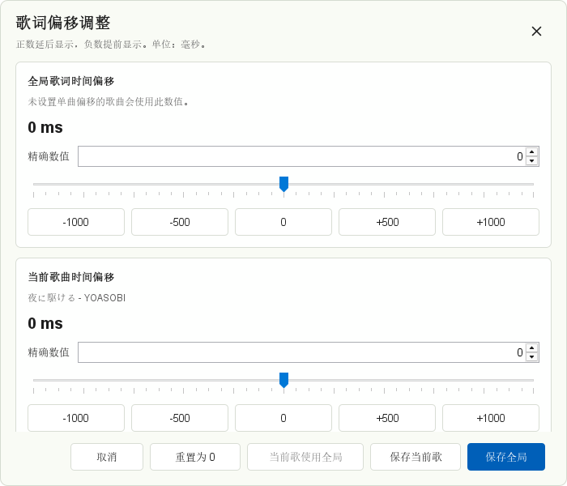

# AMLL TTML Loader for Salt Player

**简体中文** | [English](README.en.md)

AMLL TTML Loader 是一个 Salt Player for Windows workshop 插件。它会根据当前播放歌曲搜索 AMLL TTML DB，加载并转换逐词 TTML 歌词；当在线匹配不可靠、超时或不可用时，会回退到本地歌词或播放器默认歌词流程。

当前版本：`1.0.5`

## 截图

### 自动加载 AMLL 歌词


### 歌词偏移调整



### 手动匹配当前歌曲


## 用户使用

### 前置要求

- Windows
- Salt Player for Windows
- 能访问 AMLL TTML DB 和 GitHub raw 相关资源

普通用户安装插件不需要 JDK。JDK 21 只在从源码构建时需要。

### 安装

1. 从最新 GitHub Release 下载 `AMLL-TTML-Loader-1.0.5.zip`。
2. 将 zip 文件复制到：

   ```text
   %APPDATA%\Salt Player for Windows\workshop\plugins
   ```

3. 重启 Salt Player for Windows。

### 插件设置

在 Salt Player 的插件设置中可以：

- 手动匹配当前歌曲，选择 AMLL 结果或固定使用本地/元数据歌词。
- 调整歌词偏移，支持全局偏移和当前歌曲单独偏移。
- 开启或关闭运行日志。
- 切换普通或详细日志级别。
- 打开或清理日志目录。

### 歌词偏移规则

- `全局歌词时间偏移` 适用于所有未单独设置的歌曲。
- `当前歌曲时间偏移` 只对当前歌曲生效。
- 当前歌曲没有单独偏移时，会自动使用全局偏移。
- 正数表示歌词延后显示，负数表示歌词提前显示，单位为毫秒。
- 保存偏移后，重新播放当前歌曲即可看到效果。

## 功能说明

### 在线歌词匹配

- 根据当前歌曲标题、歌手、专辑信息搜索 AMLL TTML DB。
- 使用标题优先的自动匹配策略，降低同名歌、不同版本或错误元数据带来的误匹配。
- 在线搜索最多等待 10 秒；失败、超时或匹配不可靠时回退。
- 自动匹配失败会记录 7 天，过期后重新尝试。

### 歌词转换与显示

- 将 TTML 逐词歌词转换为 Salt Player 可用的 SPL 样式歌词。
- 支持主歌词、对唱/角色行、翻译、罗马音和背景人声。
- 自动隐藏 `[ti:xxx]`、`[ar:xxx]` 等歌词内置元数据行。
- 显示紧凑来源行：`来源：AMLL` 或 `来源：本地`。

### 本地歌词回退

- 支持同名旁挂 `.ttml`、`.lrc`、`.spl` 歌词文件。
- 支持读取 FLAC 元数据中的 TTML/LRC/SPL 歌词字段。
- 对被截断的本地内嵌 TTML，会尽量恢复已经完整闭合的歌词行。

### 手动匹配

- 可编辑当前歌曲的标题、歌手、专辑后重新搜索。
- 可预览候选 AMLL 歌词。
- 可将当前歌曲固定到某个 AMLL 结果。
- 可让当前歌曲固定使用本地/元数据歌词。

## 本地数据

插件会将缓存、设置和日志保存到：

```text
%APPDATA%\Salt Player for Windows\workshop\amll-ttml-loader-cache
```

重要文件：

- `raw-lyrics-index.jsonl`：AMLL 歌词索引缓存
- `song-cache.tsv`：成功的 AMLL 歌词匹配记录
- `manual-overrides.tsv`：手动选择 AMLL 或本地/默认歌词的记录
- `miss-cache.tsv`：7 天自动匹配失败记录
- `lyric-offset-ms.txt`：全局歌词偏移毫秒数
- `lyric-offsets.tsv`：单曲歌词偏移毫秒数
- `lyrics\*.spl`：转换后的歌词缓存
- `logs\*.log`：运行日志

日志格式示例：

```text
[2026-05-15 20:30:12] [INFO] [SEARCH] Searching AMLL TTML DB: title="xxx", artist="xxx"
```

插件会自动清理旧日志，保留最近 7 天或最近 10 个日志文件。日志写入失败不会影响歌词加载。

反馈 bug 时，建议只附上相关日志片段，不要提交包含隐私信息的完整日志。

## 故障排除

### 没有加载 AMLL 歌词

可能原因：

- 当前歌曲标题、歌手或专辑信息不完整。
- AMLL TTML DB 没有收录该歌曲。
- GitHub raw 或相关资源无法访问。
- 自动匹配结果不够可靠，插件回退到了本地歌词。
- 本地内嵌歌词不是 FLAC Vorbis Comment，或歌词字段不是可识别的 TTML/LRC/SPL 文本。
- 之前的匹配失败结果仍在 7 天 miss cache 中。

解决方法：

- 检查歌曲元数据。
- 打开插件设置，使用 `手动匹配当前歌曲`。
- 删除缓存后重试。
- 检查网络连接。
- 选择本地/默认歌词覆盖当前歌曲。
- 查看运行日志。

## 开发与维护

### 项目结构

- `src/main/java/dev/amll/saltplayer/ttml`：插件主体代码
- `src/spwApiStubs/java`：SPW API 编译期 stub，只用于本地编译，不打入插件 jar
- `src/main/resources/preference_config.json`：Salt Player 插件设置声明
- `src/main/resources/fonts`：弹窗 UI 内置字体和字体许可证
- `docs/images`：README 截图
- `out/plugin`：Gradle `plugin` 任务生成的插件 zip

### 从源码构建

开发环境需要 JDK 21，并确保 `JAVA_HOME` 与 `PATH` 指向可用的 JDK。

普通验证：

```powershell
.\gradlew.bat build
```

生成插件包：

```powershell
.\gradlew.bat plugin
```

输出文件：

```text
out\plugin\AMLL-TTML-Loader-1.0.5.zip
```

### 发布

- 版本号来自 `build.gradle.kts`。
- User-Agent 版本在 `src/main/java/dev/amll/saltplayer/ttml/AmllTtmlLoader.java`。
- 推送 `v*` tag 会触发 `.github/workflows/build.yml`，由 GitHub Actions 构建并上传 Release 资产。

## 网络与隐私

- 插件会根据当前歌曲标题、歌手、专辑信息请求 AMLL TTML DB，用于搜索匹配歌词。
- 插件不会上传音频文件。
- 插件不会上传用户账号信息。
- FLAC 内嵌歌词只在本机读取，不会上传。
- 歌词索引、匹配结果、偏移设置和转换后的歌词会缓存在本地。
- 如果介意网络请求，可以停用插件或使用本地/默认歌词。

## 限制

- Salt Player 当前插件 API 只允许插件在歌词加载前提供歌词，本插件无法可靠地在同一次播放中先显示本地歌词再替换为在线歌词。
- 目前只读取 FLAC Vorbis Comment 中常见歌词字段，例如 `LYRICS`、`SYNCEDLYRICS`、`UNSYNCEDLYRICS`。
- 本插件依赖 AMLL TTML DB 的索引和仓库结构，上游结构变化可能暂时影响搜索或加载。
- 在线歌词匹配效果受歌曲元数据质量影响。
- 插件不能保证所有歌曲都能找到准确歌词。

## 第三方说明

- [AMLL TTML DB](https://github.com/amll-dev/amll-ttml-db)：歌词数据来源，使用 CC0-1.0
- Salt Player for Windows：插件运行平台
- [spw-workshop-api](https://github.com/Moriafly/spw-workshop-api)：Salt Player workshop API 参考，使用 Apache-2.0；本仓库仅包含编译期 stub，不打入插件包
- [Noto Sans CJK](https://github.com/notofonts/noto-cjk)：弹窗界面内置字体，使用 OFL-1.1；字体许可证随插件包分发
- [PF4J](https://github.com/pf4j/pf4j)：插件机制 API 参考，使用 Apache-2.0；本仓库仅包含编译期 stub，不打入插件包
- Gradle：构建工具和 Gradle Wrapper，使用 Apache-2.0

完整第三方许可证说明见 [THIRD_PARTY_NOTICES.md](THIRD_PARTY_NOTICES.md)。

本插件只负责搜索、转换、缓存和显示歌词。歌词内容来自 AMLL TTML DB。用户应尊重原音乐作品、歌词文本及相关权利人的权益。
